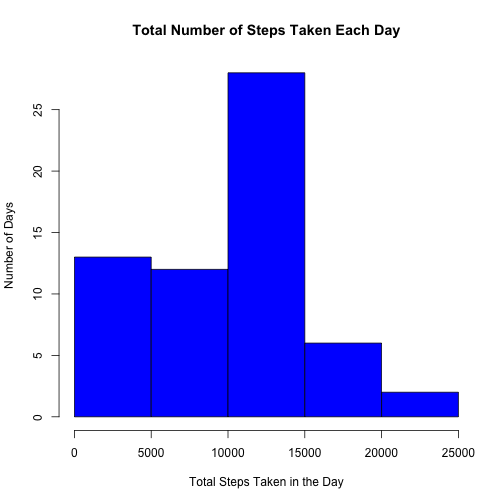
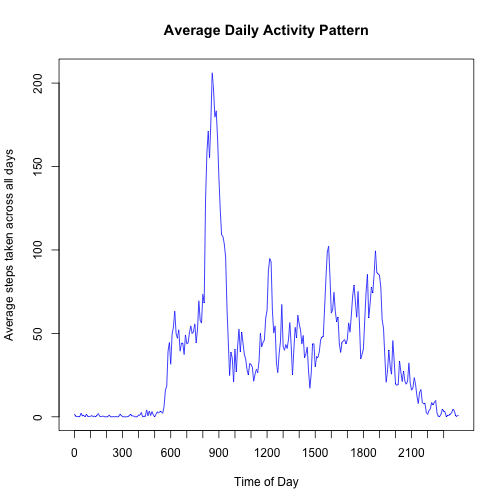
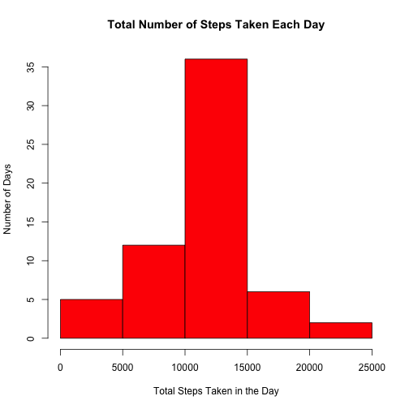
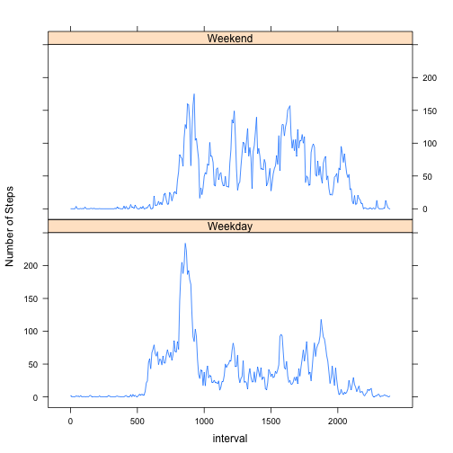

Reproducible Research: Peer Assessment 1
=========================================


## Loading and preprocessing the data

### Loading Data

We will load the data directly from the zip file using the unz function.  
The zip file with data, "activity.zip" already exists in our repository.  
The file "activity.csv" contains the data we want to analyse.  


```r
 zipfile <- unz("activity.zip",filename = "activity.csv");
 data <- read.csv(zipfile);
```

Now that we have loaded the data, lets understand its structure,  


```r
str(data)
```

```
## 'data.frame':	17568 obs. of  3 variables:
##  $ steps   : int  NA NA NA NA NA NA NA NA NA NA ...
##  $ date    : Factor w/ 61 levels "2012-10-01","2012-10-02",..: 1 1 1 1 1 1 1 1 1 1 ...
##  $ interval: int  0 5 10 15 20 25 30 35 40 45 ...
```

```r
summary(data)
```

```
##      steps                date          interval     
##  Min.   :  0.00   2012-10-01:  288   Min.   :   0.0  
##  1st Qu.:  0.00   2012-10-02:  288   1st Qu.: 588.8  
##  Median :  0.00   2012-10-03:  288   Median :1177.5  
##  Mean   : 37.38   2012-10-04:  288   Mean   :1177.5  
##  3rd Qu.: 12.00   2012-10-05:  288   3rd Qu.:1766.2  
##  Max.   :806.00   2012-10-06:  288   Max.   :2355.0  
##  NA's   :2304     (Other)   :15840
```

### Pre-processing Data

Now we will transform the data so that we can analyse it further.  

First we will calculate day of the week, i.e. Sunday, Monday  
Second we will use the above to classify the type of day, i.e. Weekday or Weekend as a factor.  
Third we will add another column to represent interval as a factor variable.


```r
dayoftheweek <- weekdays(as.Date(data$date));
weekend <- c("Saturday","Sunday");

isweekend <- dayoftheweek %in% weekend;
data$typeofday <- factor(isweekend,levels = c(FALSE,TRUE),labels = c("Weekday","Weekend"));

data$intervalf <- factor(data$interval);
```

## What is mean total number of steps taken per day?

To answer this question we will have to create a new tidy data set with sums of steps in each day.   
First we will load the dplyr package. We can then use the group_by date and summarize using sum.  
Second we can then produce the histogram with total number of steps taken each day.  
Third we can calculate and report the mean and median total number of steps taken per day.  


```r
library(dplyr);
bydate <- data %>% group_by(date) %>% summarise(totalsteps = sum(steps, na.rm = TRUE));

with(bydate, {
  hist(totalsteps, xlab = "Total Steps Taken in the Day",
       ylab = "Number of Days",
       main ="Total Number of Steps Taken Each Day",
       col = "blue")
});
```

 

```r
mean <- mean(bydate$totalsteps);
median <- median(bydate$totalsteps);
```

The mean of total number of steps taken each day is **9354.2295082**.  
The median of total number of steps taken each day is **10395**.  

## What is the average daily activity pattern?

To understand the daily activity pattern we can use the dplyr package loaded earlier.  
We need to average the steps taken at a given interval across all days.  
Therefore we will group_by interval and then summarize by mean, ignoring missing values.  
Finally we can then plot the data to understand the activity patterns  
Since we are plotting using factor variable converted to numeric, we need to modify the x-axis  


```r
byinterval <- data %>% group_by(intervalf) %>% 
  summarise(averagestepstaken = mean(steps, na.rm = TRUE)) %>%
  # Convert to numeric value so that we can plot the line
  mutate(interval = as.numeric(intervalf));

with(byinterval, {
  plot(interval,averagestepstaken,type ="n",xaxt = "n",
       xlab = "Time of Day",
       ylab = "Average steps taken across all days",
       main = "Average Daily Activity Pattern");
  
  # Correctly label the x-axis values at 3 hourly intervals
  aindex = seq(from = 1,to = 288,by = 36);
  axis(1,at = aindex,labels=intervalf[aindex],tick = FALSE);
  # Add tick marks at hourly intervals
  bindex = seq(from = 1,to = 288,by = 12);
  axis(1,at = bindex,labels = FALSE);
  # Add the plot
  lines(x = interval,y = averagestepstaken, col ="blue");
})
```

 

```r
mindex <- which.max(byinterval$averagestepstaken);
maxinterval <- as.character(byinterval$intervalf[mindex]);
```

On average across all days, Most number of steps are taken at **835**.  

## Imputing missing values

### Checking how many values are missing


```r
totalmissing <- sum(is.na(data$steps));
```

There are a total of **2304** missing values in the data set.  

### Strategy for replacing the missing values

We have previously calculated the mean number of steps taken at each interval across all days.  
Therefore we propose to use this information to fill in the missing values.  
We use the ifelse function to check and replace missing values with average steps.  

### Creating the new dataset with missing values replaces


```r
newdata <- data %>%
  mutate(steps = ifelse(is.na(steps),
                           byinterval$averagestepstaken[byinterval$intervalf %in% intervalf],
                           steps))
```

### Histogram, mean and median of the new dataset


```r
newdatabydate <- newdata %>% group_by(date) %>% summarise(totalsteps = sum(steps));

with(newdatabydate, {
  hist(totalsteps, xlab = "Total Steps Taken in the Day",
       ylab = "Number of Days",
       main ="Total Number of Steps Taken Each Day",
       col = "red")
});
```

 

```r
newmean <- as.integer(mean(newdatabydate$totalsteps));
newmedian <- as.integer(median(newdatabydate$totalsteps));
```

The new mean is **10766** and the new median is **10766**.  
Both are higher than the original mean and median total steps taken. 
This is because when we calculated the values previously, any missing values were assumed to be 0.  
This resulted in an estimate which was lower then the new estimate.  

We can clearly see the impact of imputing the missing values in the histogram plot.  
The number of days in the range [0-5000] are now lesser, while the number of days in [10000-15000] range are higher.  

## Are there differences in activity patterns between weekdays and weekends?

To explore the differences in activity patterns, we will use the old data set from the first part.  
Using dplyr package we can group by typeofday and interval and summarize by mean function.  
This will produce a new tidy data set with average activity over weekend and weekdays.  
We can then use the lattice functions for the plotting of the data set condition on type of day.  

```r
bytypeofday <- data %>%
  group_by(typeofday,intervalf) %>%
  summarise(avgsteps = mean(steps,na.rm = TRUE)) %>%
  mutate(interval=as.numeric(intervalf));

library(lattice)
# Create the appropriate scale for the x-axis in a list format, required by lattice
aindex = seq(from = 1,to = 288,by = 60);
sc = list(x = list(at = aindex, labels = levels(bytypeofday$intervalf)[aindex]));
# Plotting the data
xyplot(avgsteps ~ interval | typeofday ,data = bytypeofday, type = "l", 
       layout = c(NA,2),scales = sc, ylab = "Number of Steps")
```

 

From the above plot, we can see that generally on Weekend, people become active later in the day.  
However the level of activity on the Weekend appears to be much more then on Weekdays.
